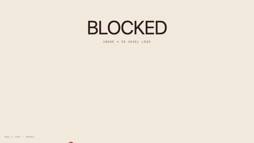

<div align="center">

# Blocked

> *Drop an image. Get a buildable brick figure.*

A 3D brick design studio that voxelizes any image into a real, orderable brick build. Drop a PNG, tune the geometry sliders, and get back a 3D figure snapped to the official Lego color palette — with a full Bill of Materials ready to paste into BrickLink. Built with Next.js 16 and React Three Fiber.



<sub>Demo recorded with <a href="https://openvid.dev">openvid.dev</a></sub>

[](https://nextjs.org)
[](https://react.dev)
[](https://threejs.org)
[](package.json)

</div>

---

## Overview

Blocked turns any image into a 3D voxelized brick figure you can actually build with real Lego-compatible pieces. A front-driven voxelizer reconstructs shape and depth from silhouettes; the studio editor lets you tune resolution, density, and background cut in real time. When you're done, export a BrickLink XML parts list — 34 official colors, exact piece counts by size.

## Tech stack

| Layer | Tech |
| --- | --- |
| Framework | Next.js 16 (App Router) |
| UI | React 19, Tailwind CSS v4 |
| 3D / rendering | Three.js, React Three Fiber, Drei |
| Animation | GSAP 3 |
| Testing | Vitest, Testing Library |

## Quick start

**Requirements**: Node ≥ 20, pnpm

```bash
git clone https://github.com/victorgalvez56/blocked.git
cd blocked
pnpm install
pnpm dev
```

Open [http://localhost:3000](http://localhost:3000) and drop an image on the studio.

## Architecture

```
     image drop
          ↓
     voxelizer  (client-side, Three.js orthographic cameras)
┌──────────────────────────────┐
│  front silhouette → depth    │
│  side / top as thickness cap │
│  palette snap + brick merge  │
└──────────────────────────────┘
          ↓
┌──────────────────────────────┐
│  Studio  (React Three Fiber) │
│  — geometry sliders          │
│  — live 3D voxel preview     │
│  — BOM panel + export        │
└──────────────────────────────┘
```

## Project structure

```
.
├── src/
│   ├── app/
│   │   └── studio/         # main design studio
│   ├── lib/
│   │   ├── voxelizer/      # image → 3D voxel grid
│   │   ├── exporters/      # BrickLink XML export
│   │   └── color/          # official Lego palette (34 colors)
│   └── types/              # shared TypeScript types
├── data/                   # brick palette data
└── docs/
    └── preview.gif
```

## Features

### Voxelizer

The front view drives the silhouette and shape. Side and top views act as per-row/column thickness caps — no cross-shaped extrusion artifacts. Bricks are centered around `midZ` for symmetric depth. Resolution goes up to 48 studs per axis; density and background-cut are tunable sliders.

**Brick optimization** merges adjacent same-color 1×1s into larger pieces (1×2, 1×4, 1×6, 1×8, 2×3, 2×4). **Hollow interior** skips pieces that will never be visible, cutting piece count significantly.

### Studio controls

| Action | How |
| --- | --- |
| Orbit | Left-drag |
| Zoom | Scroll |
| Pan | Right-drag |
| Build mode | Layer-by-layer slice view |
| Explode | Separates bricks for interior inspection |
| Export | BrickLink XML — paste into Wanted List |

## Contributing

PRs welcome. The codebase is small enough to read top-to-bottom in an afternoon.

1. **Fork → clone → branch** (`git checkout -b feat/your-thing`)
2. Run locally with `pnpm dev`
3. Keep changes scoped — one feature/fix per PR
4. Match existing style: TypeScript strict, Tailwind for all styling, no inline styles
5. No formatting-only commits mixed with logic changes
6. Open a PR with a short description of *why* the change matters, not *what*

### Good first issues

- Multi-size brick support (1×2, 2×2, 2×4) with collision detection in the editor
- Auto-optimization mode: merge adjacent same-color 1×1s into larger pieces
- Symmetry / mirror mode across X or Z axis in the studio
- Multi-select, group move, and copy/paste in the studio
- Layer visibility toggle for working on interior sections
- Step-by-step build instructions exported as a layer-by-layer PDF
- Estimated cost preview based on BrickLink marketplace prices

### Conventions

- **Commits**: imperative present tense, no trailing period (`add multiview pipeline`, not `Added multiview pipeline.`)
- **Types**: all shared types live in `src/types/`, co-located types in the same file as their consumer
- **Magic numbers**: lift to module-level constants
